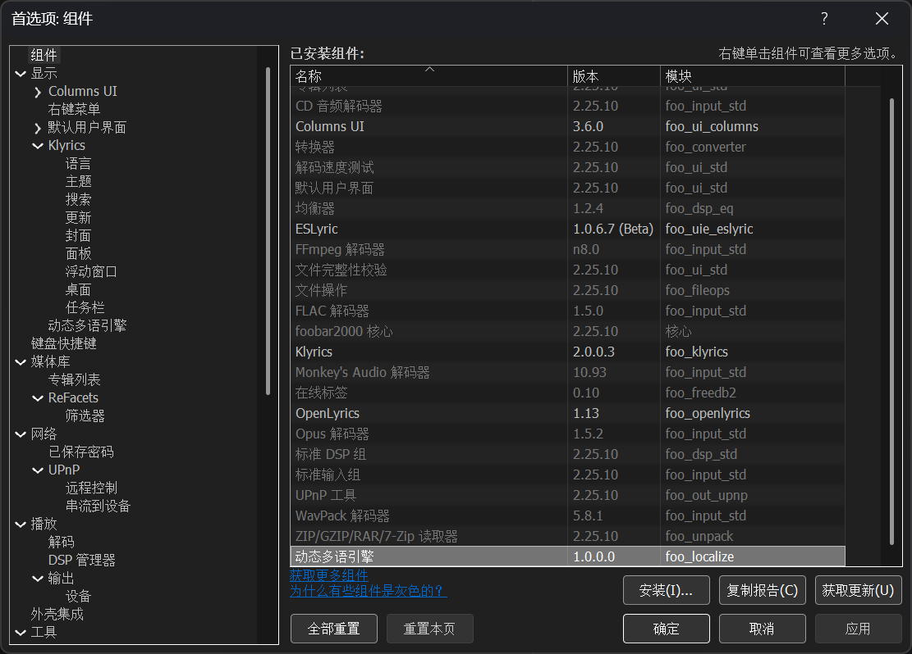
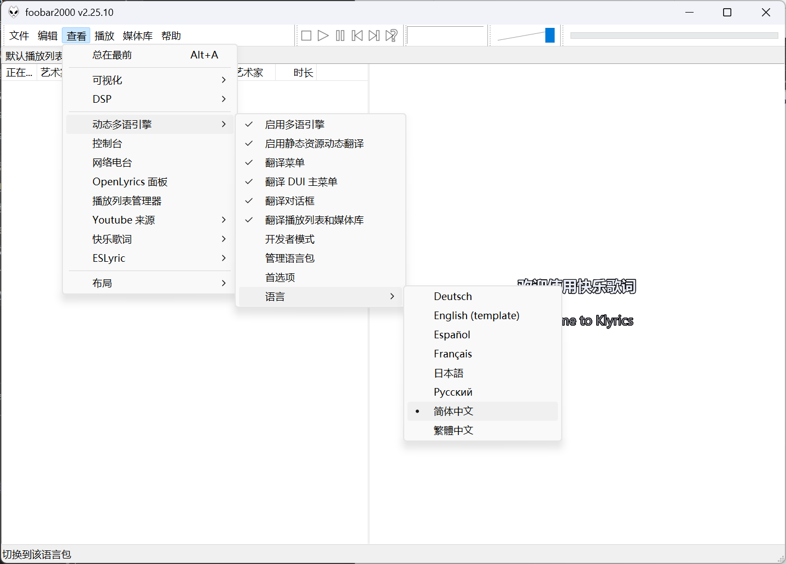
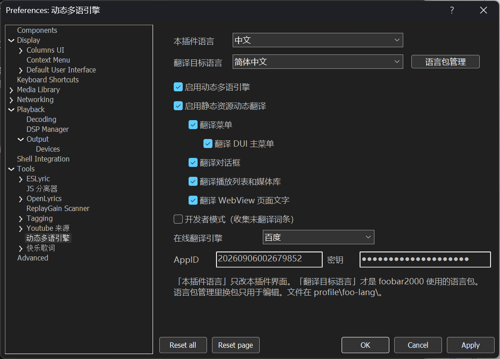
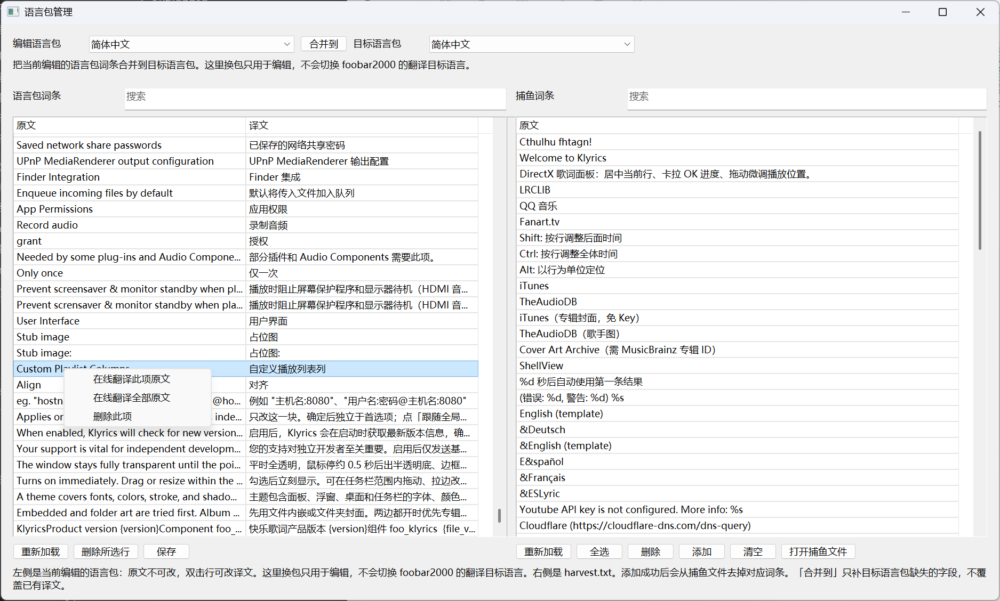
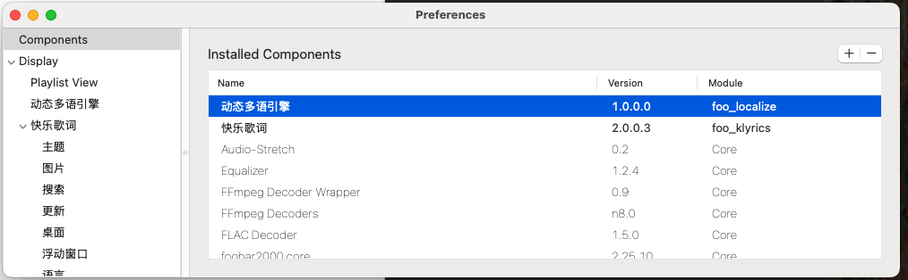
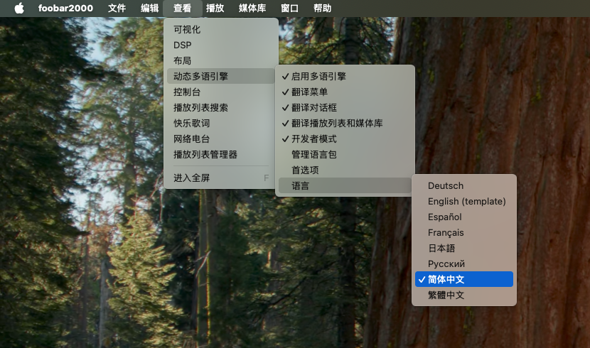
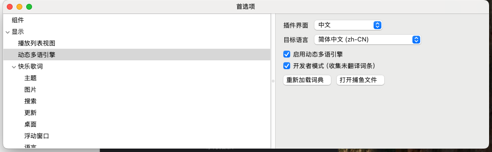
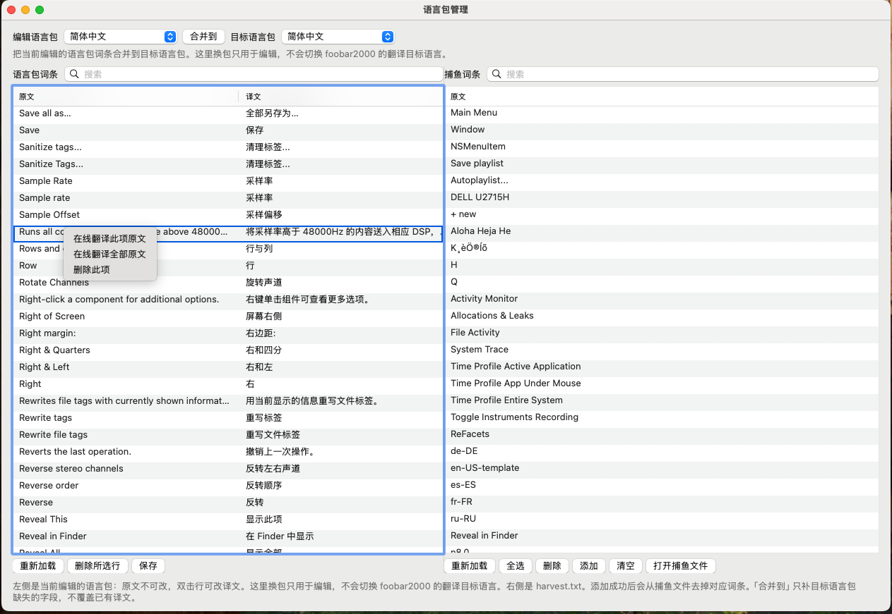

# 动态多语引擎（foo_localize）

foobar2000 运行时多语言组件。不改官方程序，用外置 JSON 语言包替换界面英文。换一份语言包即可切换简体、繁体、日、俄、西、德、法等，不限于中文。英文显示名 **Dynamic Multilingual Engine**。

当前组件版本：`1.4.1`。English: [README_en.md](README_en.md)。

本仓库只托管**编译包说明**和开源的语言包 JSON，不公开插件源码。安装包在仓库的 **[Releases](https://github.com/hehelp/foo_localize/releases)** 页。

## 更新

### 1.4.1（2026-09-06）

- 语言包管理窗口：右键可分别复制原文、译文到剪贴板
- 简中词典补充约 99 条（列头、Klyrics、可视化、Cover Art Archive 等），并同步到繁/日/俄/西/德/法

### 1.4.0（2026-09-06）

- 在线翻译：可以在语言包管理窗口，使用在线翻译引擎，自动翻译原文
- Windows / macOS：首选项可选在线翻译引擎（Google / 百度）并填写 AppID、密钥
- macOS：语言包管理窗口与 Windows 对齐（预览、合并、改译文、在线翻译）

### 1.3.0（2026-09-05）

- 独立语言包管理窗口：选包预览、合并到目标语言、列表内直接改译文
- Windows：新增「翻译 DUI 主菜单」开关（默认开，须同时开「翻译菜单」）；绘制按顶栏词与 BeginPaint 窗口区分，减少首选项叠字
- Windows：翻译播放列表只作用于主窗口，避免 YouTube「页面中搜寻」等插件对话框重影
- 简中词典补：Playing / Artist/album / Title / track artist / Track no
- 语言包管理、DUI 开关与内容轨范围仅 Windows；macOS 行为与 1.2.2 相同

### 1.2.2（2026-09-04）

- Windows x64：修复 1.2.1 误把几乎所有界面文本当成无效指针，导致运行时字符串和 Default UI 主菜单不翻译

### 1.2.1（2026-09-04）

- Windows：修复其它插件弹出系统文件对话框时崩溃（`SetWindowTextW` 收到 `(LPWSTR)-1` 哨兵）

### 1.2.0（2026-09-04）

- Windows：可开关「启用静态资源动态翻译」，字符串表与对话框模板按词典替换
- Windows：JScript Panel / Spider Monkey Panel 可用 `new ActiveXObject("FooLocalize.Engine")` 翻译自绘文本
- Windows：Default UI 顶栏启动即为译文，窗口不再为此抖动
- 静态资源与 COM 仅 Windows；macOS 行为与 1.1.0 相同

### 1.1.0（2026-09-03）

- 可分别开关：翻译菜单、翻译对话框、翻译播放列表和媒体库
- 播放列表 / 媒体库列头可译；查词去掉零宽空格等格式符，并识别 `%year%` / `%length%`
- Windows：主菜单按译文量宽；对话框不再英文叠中文；SysLink 链接文字可译
- macOS：语言列表挂在 `查看 → 动态多语引擎` 下，与 Windows 一致

### 1.0.0（2026-09-02）

- 首发：Windows 32 / 64 位与 macOS
- 主菜单、右键菜单、首选项、对话框、窗口标题可按语言包替换
- `查看 → 动态多语引擎 → 语言` 热切换；开发者模式把未译词条写入 `harvest.txt`
- 内置简中、繁中、日、俄、西、德、法及英文模板；首次启动写入 `foo-lang`（不覆盖已有文件）

## 截图

### Windows









### macOS









## 支持的播放器

| 项目 | 要求 |
| --- | --- |
| 系统 | Windows 10 / 11；macOS 11+ |
| 播放器 | **foobar2000 2.0 及以上**（32 位与 64 位均可） |
| 不支持 | foobar2000 1.x；Windows 组件不能装到 Mac，反之亦然 |

32 位与 64 位是两份 DLL，不能混用。

| 播放器 | 组件文件 | 安装目录 |
| --- | --- | --- |
| foobar2000 2.x **32 位** | `foo_localize.dll` | `%APPDATA%\foobar2000-v2\user-components\foo_localize\` |
| foobar2000 2.x **64 位** | `foo_localize.dll` | `%APPDATA%\foobar2000-v2\user-components-x64\foo_localize\` |
| foobar2000 **Mac** | `foo_localize.component` | `~/Library/foobar2000-v2/user-components/` |

语言包在用户配置目录，不进官方程序目录：

| 系统 | 语言包目录 |
| --- | --- |
| Windows | `%APPDATA%\foobar2000-v2\foo-lang\` |
| macOS | `~/Library/foobar2000-v2/foo-lang\` |

## 安装

1. 打开 **[Releases](https://github.com/hehelp/foo_localize/releases)**，下载 **`foo_localize-1.4.0.fb2k-component`**（foobar 官方组件封装：一份 zip，内含 32 位、64 位与 macOS，安装时按架构自选）。
2. 在 foobar：**文件 → 首选项 → 组件 → 安装**，选中该文件。
3. 也可把对应架构的 DLL / `.component` 拷到上表目录后**完全退出再打开** foobar2000。

首次启动会把内置语言包写到 `foo-lang`（目录里还没有同名文件时才写）。**已有的 JSON 不会被覆盖**，升级组件不会丢掉你改过的译文。

64 位 Windows 常见路径：

```
C:\Users\<用户名>\AppData\Roaming\foobar2000-v2\user-components-x64\foo_localize\foo_localize.dll
C:\Users\<用户名>\AppData\Roaming\foobar2000-v2\foo-lang\
```

foobar 正在运行时无法覆盖 DLL，请先退出再拷。

## 使用

- **总开关**：初次安装后默认关闭。先 `查看 → 动态多语引擎 → 启用多语引擎`，或在首选项里勾选启用。
- **范围**：可分别开关「翻译菜单」「翻译 DUI 主菜单」「翻译对话框」「翻译播放列表和媒体库」。Windows 另有「启用静态资源动态翻译」（受总开关约束，默认关）。
- **切语言**：`查看 → 动态多语引擎 → 语言`，或 **文件 → 首选项 → 显示 → 动态多语引擎** 里选「翻译目标语言」。点「语言包管理」可编辑词条、合并捕鱼、在线翻译。
- **开发者模式**：同在 `查看 → 动态多语引擎`。
- 开发者模式会把未翻译的界面英文追加到 `foo-lang/harvest.txt`。把新键合并进对应 JSON 后，再选一次语言或重启即可。

`en-US-template.json` 的译文全是空字符串，选它等于显示英文原文，适合当自制语言包的底板。

换语言后菜单和对话框会立刻重刷；个别自绘控件可能要再打开一次窗口才重画。

## 语言包规范

界面英文是键，译文在 JSON。空值 = 画面显示原文。不要用空字符串表示「隐藏」。

| 规则 | 说明 |
| --- | --- |
| 精确匹配 | 按界面原文查找；大小写可折叠，行首 `•` / 首尾空白与零宽格式符会去掉后再查 |
| `@name` | 只出现在语言菜单，不参与替换 |
| 菜单加速键 | 原文里 `\t` 后面是快捷键，只译前面的可见文字 |
| 空译文 | 不翻译，保留英文 |
| 不译 | 歌名、文件名、播放列表名、路径、网址、`foobar2000`、`foo_*`、`ReFacets`、`UPnP`、`FFmpeg`、字体名、Title Formatting、配置脚本 |
| 首次写入 | 内置包只在 `foo-lang` 里**没有**该文件时写出 |
| 升级 | 不会覆盖已有 JSON；要恢复某份种子，先备份再删该文件后重启 |
| 补词 | 开发者模式 → `harvest.txt` → 合并进 JSON → 再选一次语言 |

本仓库 [`dict/`](dict/) 与组件内置种子一致，可对照或另存新语言。编写说明：[语言包编写指南](docs/lang-pack.md)。

随附文件：

| 文件 | 显示名 |
| --- | --- |
| `zh-CN.json` | 简体中文 |
| `zh-TW.json` | 繁體中文 |
| `ja-JP.json` | 日本語 |
| `ru-RU.json` | Русский |
| `es-ES.json` | Español |
| `de-DE.json` | Deutsch |
| `fr-FR.json` | Français |
| `en-US-template.json` | English (template) |

Windows **Columns UI 状态栏**音量格目前画的是 `-3.00 dB`，没有可替换的 `volume` 单词，这条暂时搁置。

## 首选项

**文件 → 首选项 → 显示 → 动态多语引擎**

可开关引擎、翻译范围（含 DUI 主菜单）、打开开发者模式、选择「本插件语言」与「翻译目标语言」，以及在线翻译引擎 / AppID / 密钥。点「语言包管理」可在独立窗口编辑词条。查看菜单分组名跟本插件语言走：中文 **动态多语引擎**，英文 **Dynamic Multilingual Engine**。

## 给其他组件的 API

C++ 组件：头文件和可编译示例在 [`sdk/`](sdk/README.md)。把 [`sdk/foo_localize_api.h`](sdk/foo_localize_api.h) 拷进你的工程，用 `localize_api::tryGet` 查询/切换语言、翻译字符串；实现 `localize_notify` 并 `FB2K_SERVICE_FACTORY` 即可在语言切换时收到广播。完整插件示例：[`sdk/sample/`](sdk/sample/README.md)。

JScript / SMP 面板（仅 Windows）：`new ActiveXObject("FooLocalize.Engine")`，只读方法 `Translate` / `GetLanguage` / `IsEnabled`。未安装本组件时 `try/catch` 回退英文。

说明见 [组件 API](docs/api.md)。English: [docs/api.en.md](docs/api.en.md)。
