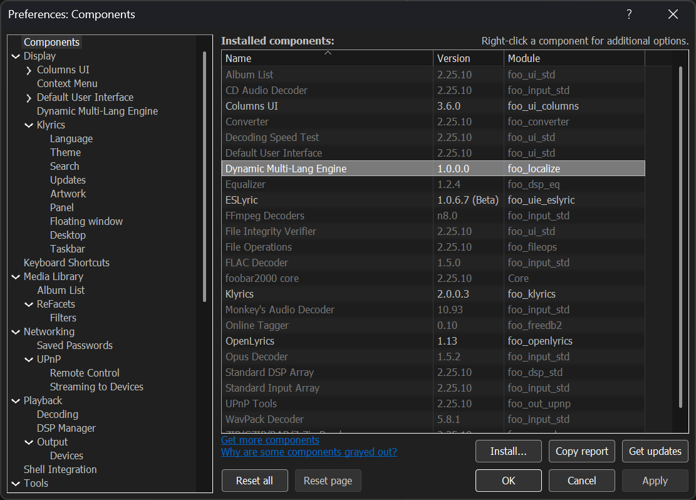
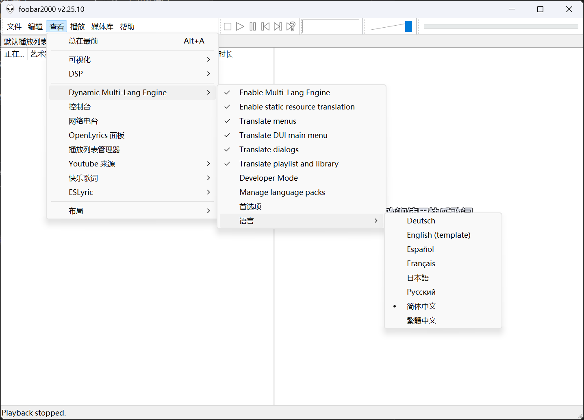
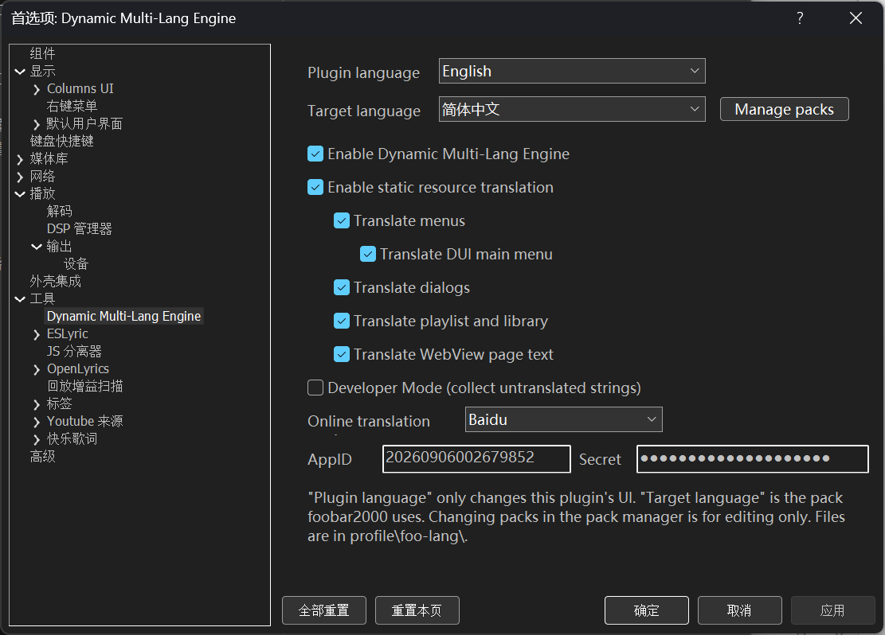
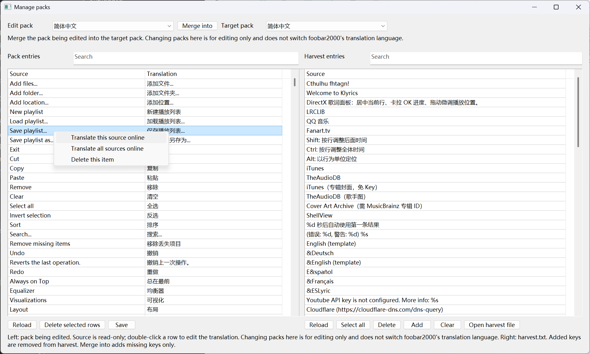
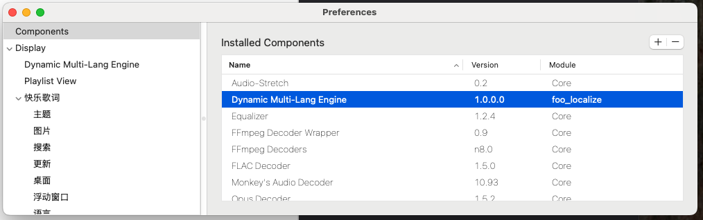
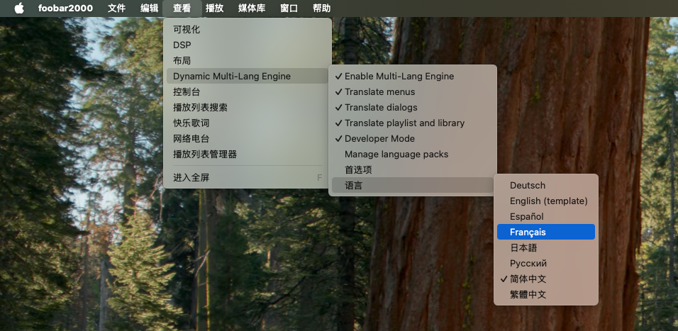
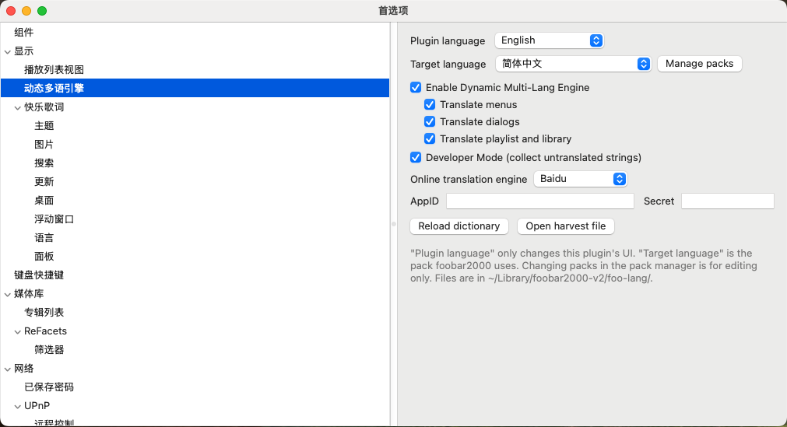
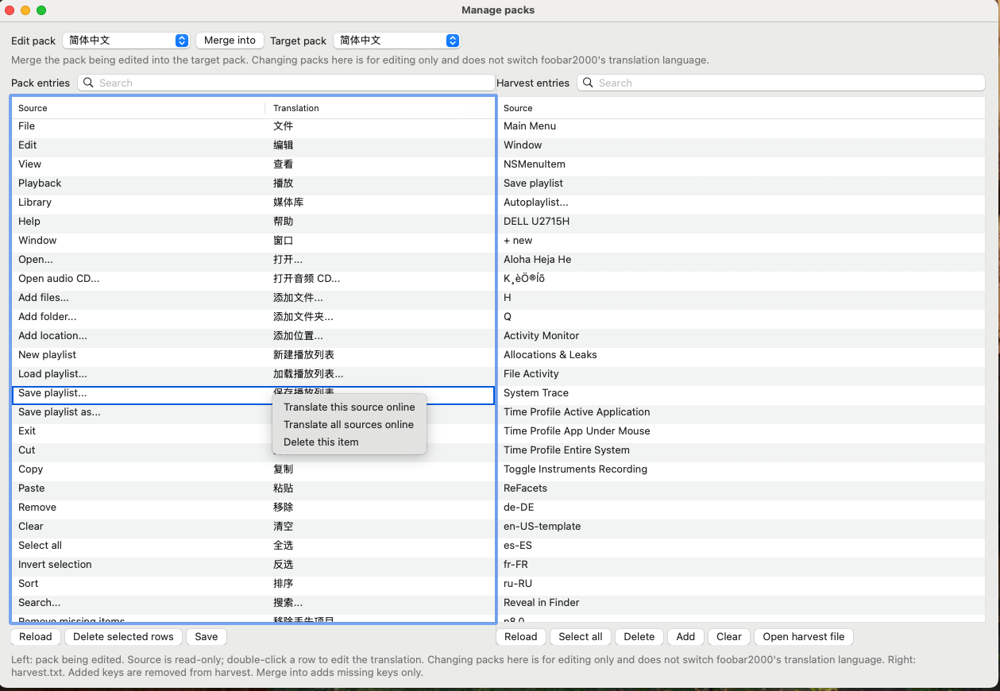

# Dynamic Multilingual Engine (foo_localize)

A runtime localization component for foobar2000. It does not patch the official binaries. UI English is replaced from external JSON language packs. Swap the pack to switch Simplified Chinese, Traditional Chinese, Japanese, Russian, Spanish, German, French, and others. Chinese display name **动态多语引擎**.

Component version: `1.4.1`. 中文：[README.md](README.md).

This repository hosts **release notes** and open language-pack JSON. The component source is not published. Get the installer from the repo **[Releases](https://github.com/hehelp/foo_localize/releases)** page.

## Updates

### 1.4.1 (2026-09-06)

- Language-pack window: right-click to copy the source or the translation separately
- About 99 new Simplified Chinese entries (column headers, Klyrics, visualizations, Cover Art Archive, and more), synced to Traditional Chinese / Japanese / Russian / Spanish / German / French

### 1.4.0 (2026-09-06)

- Online translation: in the language-pack window, use an online engine to translate source strings automatically
- Windows / macOS: choose an online translation engine (Google / Baidu) and enter AppID / secret in Preferences
- macOS: language-pack window now matches Windows (preview, merge, edit, online translate)

### 1.3.0 (2026-09-05)

- Standalone language-pack window: preview a pack, merge into a target language, and edit translations in the list
- Windows: new **Translate DUI main menu** switch (on by default; also requires **Translate menus**); paint uses bar titles and the BeginPaint window so Preferences no longer stacks English under Chinese
- Windows: playlist translation applies only to the main window, so plugin dialogs such as YouTube **Find in page** no longer ghost
- Simplified Chinese pack: Playing / Artist/album / Title / track artist / Track no
- Pack manager, DUI switch, and content-scope rules are Windows-only; macOS matches 1.2.2

### 1.2.2 (2026-09-04)

- Windows x64: fix 1.2.1 rejecting nearly all UI text pointers, which left runtime strings and the Default UI menu bar untranslated

### 1.2.1 (2026-09-04)

- Windows: fix a crash when other components open the system file dialog (`SetWindowTextW` received `(LPWSTR)-1`)

### 1.2.0 (2026-09-04)

- Windows: optional static-resource translation (string tables and dialog templates)
- Windows: JScript Panel / Spider Monkey Panel can call `new ActiveXObject("FooLocalize.Engine")` for owner-drawn text
- Windows: Default UI menu bar is translated on startup, without a window jump
- Static resources and COM are Windows-only; macOS matches 1.1.0

### 1.1.0 (2026-09-03)

- Separate toggles for menus, dialogs, and playlist / library text
- Playlist and library column headers translate; lookups strip zero-width format characters and accept `%year%` / `%length%` wrappers
- Windows: menu items measure translated width; dialogs no longer paint English under Chinese; SysLink captions translate
- macOS: the Language list lives under **View → Dynamic Multilingual Engine**, matching Windows

### 1.0.0 (2026-09-02)

- First release: Windows 32 / 64-bit and macOS
- Main menus, context menus, Preferences, dialogs, and window titles follow the language pack
- **View → Dynamic Multilingual Engine → Language** switches packs live; Developer Mode writes missing strings to `harvest.txt`
- Built-in Simplified / Traditional Chinese, Japanese, Russian, Spanish, German, French, and an English template; first launch writes them to `foo-lang` (existing files are never overwritten)

## Screenshots

### Windows









### macOS









## Supported players

| Item | Requirement |
| --- | --- |
| OS | Windows 10 / 11; macOS 11+ |
| Player | **foobar2000 2.0+** (32-bit or 64-bit) |
| Not supported | foobar2000 1.x; Windows components cannot be loaded on Mac and vice versa |

32-bit and 64-bit are two different DLLs. Do not mix them.

| Player | Component file | Install folder |
| --- | --- | --- |
| foobar2000 2.x **32-bit** | `foo_localize.dll` | `%APPDATA%\foobar2000-v2\user-components\foo_localize\` |
| foobar2000 2.x **64-bit** | `foo_localize.dll` | `%APPDATA%\foobar2000-v2\user-components-x64\foo_localize\` |
| foobar2000 **Mac** | `foo_localize.component` | `~/Library/foobar2000-v2/user-components/` |

Language packs stay in the user profile, not the program folder:

| OS | Language-pack folder |
| --- | --- |
| Windows | `%APPDATA%\foobar2000-v2\foo-lang\` |
| macOS | `~/Library/foobar2000-v2/foo-lang\` |

## Install

1. Open **[Releases](https://github.com/hehelp/foo_localize/releases)** and download **`foo_localize-1.4.0.fb2k-component`** (official foobar package: one zip with 32-bit, 64-bit, and macOS; Install picks the matching binary).
2. In foobar: **File → Preferences → Components → Install**, then pick that file.
3. Or copy the matching DLL / `.component` into the folder above and **fully quit, then reopen** foobar2000.

On first launch the built-in packs are written to `foo-lang` **only when that file is missing**. Existing JSON is never overwritten, so upgrading the component does not discard your edits.

A typical 64-bit Windows path:

```
C:\Users\<name>\AppData\Roaming\foobar2000-v2\user-components-x64\foo_localize\foo_localize.dll
C:\Users\<name>\AppData\Roaming\foobar2000-v2\foo-lang\
```

foobar cannot overwrite the DLL while it is running. Quit first.

## Usage

- **Master switch**: Off after a fresh install. Enable it under **View → Dynamic Multilingual Engine → Enable**, or in Preferences.
- **Scopes**: separately enable menus, **Translate DUI main menu**, dialogs, and playlist / library text. Windows also has **Enable static resource translation** (gated by the master switch, off by default).
- **Switch language**: **View → Dynamic Multilingual Engine → Language**, or **File → Preferences → Display → Dynamic Multilingual Engine** and pick **Target language**. **Manage packs** edits entries, merges harvest files, and can translate online.
- **Developer Mode**: same **View → Dynamic Multilingual Engine** submenu.
- Developer Mode appends unmatched UI English to `foo-lang/harvest.txt`. Merge new keys into the JSON, then pick the language again or restart.

`en-US-template.json` has empty values, so selecting it shows the original English. Use it as a blank for a new pack.

Menus and dialogs refresh immediately after a switch. A few owner-drawn controls may need the window reopened.

## Language-pack rules

The English UI string is the key; the translation is the JSON value. An empty value leaves the original text on screen. Do not use an empty string to mean “hide”.

| Rule | Meaning |
| --- | --- |
| Exact match | Look up the on-screen source text; ASCII case can fold, and a leading `•` / surrounding spaces / zero-width format characters are stripped first |
| `@name` | Language-menu label only; not substituted into the UI |
| Menu accelerators | Text after `\t` is the shortcut; translate only the visible part before `\t` |
| Empty value | Do not translate |
| Do not translate | Track titles, file names, playlist names, paths, URLs, `foobar2000`, `foo_*`, `ReFacets`, `UPnP`, `FFmpeg`, font names, Title Formatting, config scripts |
| First-run seed | A built-in pack is written only if that file is **absent** from `foo-lang` |
| Upgrades | Existing JSON is kept; to restore a shipped pack, back it up, delete that file, and restart |
| Harvest | Developer Mode → `harvest.txt` → merge into JSON → pick the language again |

[`dict/`](dict/) in this repo matches the built-in seeds. Writing guide: [Language pack guide](docs/lang-pack.en.md).

Shipped files:

| File | Display name |
| --- | --- |
| `zh-CN.json` | 简体中文 |
| `zh-TW.json` | 繁體中文 |
| `ja-JP.json` | 日本語 |
| `ru-RU.json` | Русский |
| `es-ES.json` | Español |
| `de-DE.json` | Deutsch |
| `fr-FR.json` | Français |
| `en-US-template.json` | English (template) |

The Windows **Columns UI** status-bar volume cell currently draws `-3.00 dB`, not the word `volume`. That path is deferred.

## Preferences

**File → Preferences → Display → Dynamic Multilingual Engine** (Chinese UI: **动态多语引擎**)

Enable the engine, the translation scopes (including the DUI main menu), Developer Mode, **Plugin language**, **Target language**, and the online engine / AppID / secret. **Manage packs** opens a window to edit entries. The View menu group follows the plugin language: **动态多语引擎** in Chinese, **Dynamic Multilingual Engine** in English.

## API for other components

C++ components: the header and a buildable sample live in [`sdk/`](sdk/README.md). Copy [`sdk/foo_localize_api.h`](sdk/foo_localize_api.h) into your project and call `localize_api::tryGet`. Implement `localize_notify` and register it with `FB2K_SERVICE_FACTORY` to hear language changes. Full sample component: [`sdk/sample/`](sdk/sample/README.md).

JScript / SMP panels (Windows only): `new ActiveXObject("FooLocalize.Engine")` with read-only `Translate` / `GetLanguage` / `IsEnabled`. If the component is not installed, catch the error and keep English.

See [Component API](docs/api.md).
